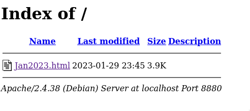
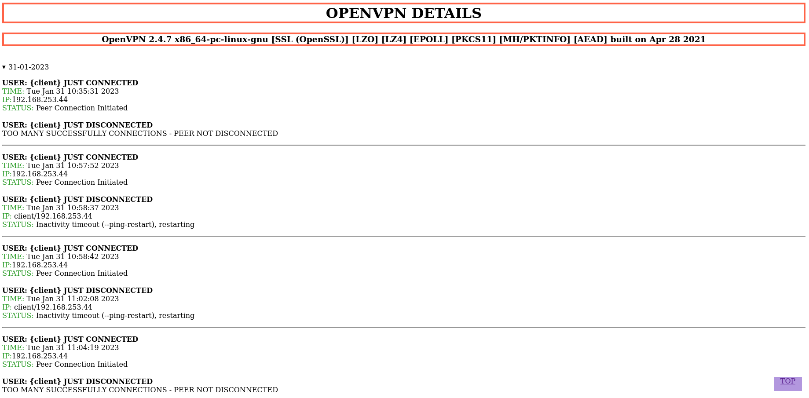

# OVPN STATUS

Ovpn server file must have this line:

	log-append /var/log/openvpn/openvpn.log

Make sure to comment:

	;log /var/log/openvpn/openvpn.log

You have to enable cron to execute this script:

	45 23 * * *	/root/monitorvpn.sh
	(every day at 23:45 it will execute)

Then, you need to install Apache2 to show the HTML code. \
Be sure to remove the default 'index.html' file.

